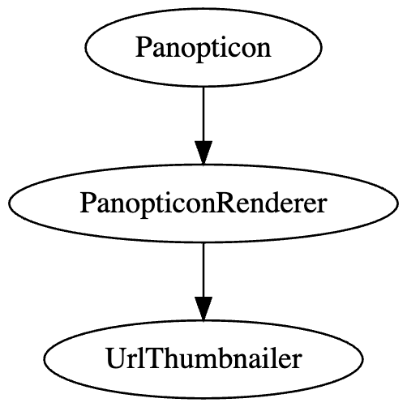

# Panopticon

    
    
                                    ██▓▒▒▒▒▒▒▒▒▒▒▒▒▒▒▒▒▒▒▒▓██
                             ██▓▒▒▒▒▒▒▒▒▒▒▒▒▒▒▒▒▒▒▒▒▒▒▒▒▒▒▒▒▒▒▒▒▒▓██
                         █▒▒▒▒▒▒▒▒▒▒▒▒▒▒▒▒▒▒▒▒▒▒▒▒▒▒▒▒▒▒▒▒▒▒▒▒▒▒▒▒▒▒▒▒▓█
                     █▓▒▒▒▒▒▒▒▒▒▒▒▒▒▒▒▒▒▒▒▒▒▒▒▒▒▒▒▒▒▒▒▒▒▒▒▒▒▒▒▒▒▒▒▒▒▒▒▒▒▒▒▓█
                 ████▒▒▒▒▒▒▒▒▒▒▒▒▒▒▒▒▒▒▒▒▒▒▓█████████▓▒▒▒▒▒▒▒▒▒▒▒▒▒▒▒▒▒▒▒▒▒▒▓███
              ██████▒▒▒▒▒▒▒▒▒▒▒▒▒▒▒▒▒▒▒▒▒███████████████▒▒▒▒▒▒▒▒▒▒▒▒▒▒▒▒▒▒▒▒▓██████
           █████████▒▒▒▒▒▒▒▒▒▒▒▒▒▒▒▒▒▒▒██████████████████▓▒▒▒▒▒▒▒▒▒▒▒▒▒▒▒▒▒▒▒█████████
        ███████████▓▒▒▒▒▒▒▒▒▒▒▒▒▒▒▒▒▒▒█████████████████████▒▒▒▒▒▒▒▒▒▒▒▒▒▒▒▒▒▒▓███████████
      █████████████▓▒▒▒▒▒▒▒▒▒▒▒▒▒▒▒▒▒▒█████████████████████▒▒▒▒▒▒▒▒▒▒▒▒▒▒▒▒▒▒▓█████████████
    ███████████████▓▒▒▒▒▒▒▒▒▒▒▒▒▒▒▒▒▒███████████████████████▒▒▒▒▒▒▒▒▒▒▒▒▒▒▒▒▒▓███████████████
    ███████████████▓▒▒▒▒▒▒▒▒▒▒▒▒▒▒▒▒▒███████████████████████▒▒▒▒▒▒▒▒▒▒▒▒▒▒▒▒▒▓███████████████
      █████████████▓▒▒▒▒▒▒▒▒▒▒▒▒▒▒▒▒▒▓█████████████████████▒▒▒▒▒▒▒▒▒▒▒▒▒▒▒▒▒▒▓█████████████
        ████████████▒▒▒▒▒▒▒▒▒▒▒▒▒▒▒▒▒▒█████████████████████▒▒▒▒▒▒▒▒▒▒▒▒▒▒▒▒▒▒████████████
           █████████▓▒▒▒▒▒▒▒▒▒▒▒▒▒▒▒▒▒▒███████████████████▒▒▒▒▒▒▒▒▒▒▒▒▒▒▒▒▒▒▓█████████
              ███████▒▒▒▒▒▒▒▒▒▒▒▒▒▒▒▒▒▒▒▒███████████████▒▒▒▒▒▒▒▒▒▒▒▒▒▒▒▒▒▒▒▒███████
                 ████▓▒▒▒▒▒▒▒▒▒▒▒▒▒▒▒▒▒▒▒▒▒▓█████████▓▒▒▒▒▒▒▒▒▒▒▒▒▒▒▒▒▒▒▒▒▒▓████
                    ██▓▒▒▒▒▒▒▒▒▒▒▒▒▒▒▒▒▒▒▒▒▒▒▒▒▒▒▒▒▒▒▒▒▒▒▒▒▒▒▒▒▒▒▒▒▒▒▒▒▒▒▒▓██
                        ██▒▒▒▒▒▒▒▒▒▒▒▒▒▒▒▒▒▒▒▒▒▒▒▒▒▒▒▒▒▒▒▒▒▒▒▒▒▒▒▒▒▒▒▒▒██
                             █▓▓▒▒▒▒▒▒▒▒▒▒▒▒▒▒▒▒▒▒▒▒▒▒▒▒▒▒▒▒▒▒▒▒▒▓▓█
                                   ███▓▒▒▒▒▒▒▒▒▒▒▒▒▒▒▒▒▒▒▒▓███

## Development

Building:

    forge build

Run tests:

    forge test -vv

Running tests also outputs traits as JSON and a batch of test outputs to folder `generated`

If you have troubles getting dependencies work here are the steps to reinstall:

    forge install foundry-rs/forge-std
    forge install openzeppelin/openzeppelin-contracts
    forge install vectorized/solady
    forge install gnsps/solidity-bytes-utils
    forge install holic/ethfs
    forge install intartnft/scripty.sol

## Stack

## Contract deployment

Make sure .env contains correct configs and environment variable
`NETWORK` is set to either `GOERLI` or `MAINNET`

Load config from .env:

    source .env

Dry run (does not deploy anything):
 
    NETWORK=GOERLI forge script DeployPanopticon -f $RPC_URL_GOERLI
    NETWORK=MAINNET forge script DeployPanopticon -f $RPC_URL_MAINNET

To deploy and verify contracts, add parameters:

    --verify --broadcast

Contract verification particularly in Etherscan sometimes fails for no apparent reason.
To verify deployed contracts afterwards use:

    forge verify-contract [address] [SomeContract] --chain 5 --constructor-args "0000...123123" --watch

You need to pass in exact constructor parameters in constructor args. For encoding look into services such as hashex.org (https://abi.hashex.org/)
